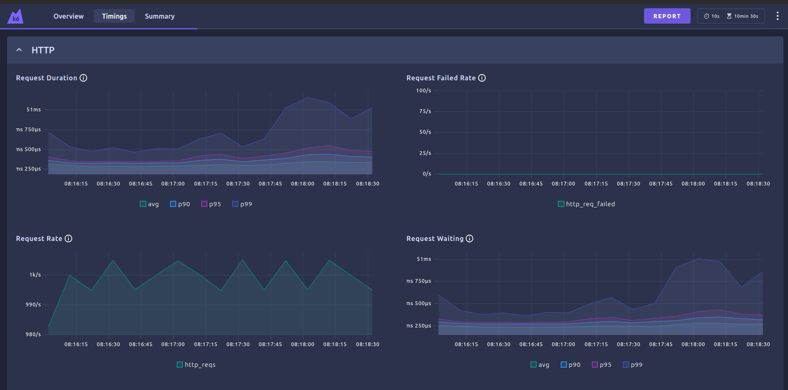
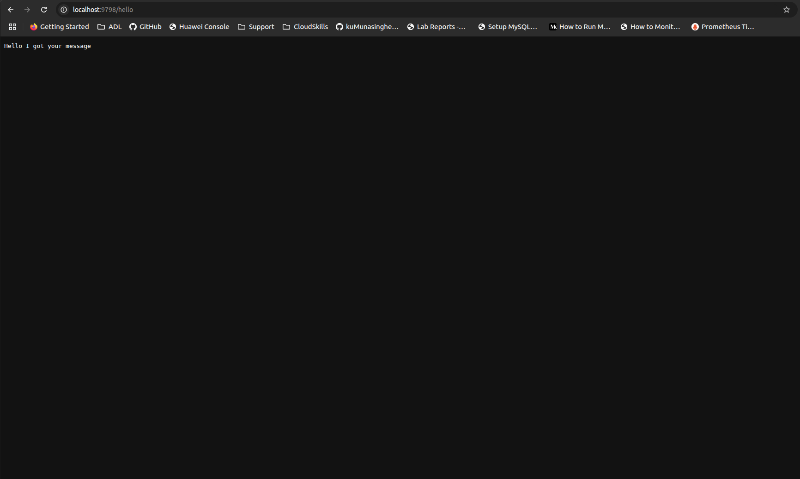

# Helllo BackEnd
written in c++, with customizable server response time for load testing, 

tested for 
  - 2000 threds
  - 1000 rps

## How to build

- build the docker
    ``docker build -t kasunum/hello_backend .``

## How to run

- if you are not build the image locally, pull the image

    ``docker pull kasunum/hello_backend:<TAG>``

- run the docker

    ``docker run -d -p 9798:9798 kasunum/hello_backend``

- on broswer

    ``http://localhost:9798/hello``

    

## Config server response time

``curl -X POST http://localhost:9798/config -H "Content-Type: application/json" -d '{"response_delay_ms":500}'``
